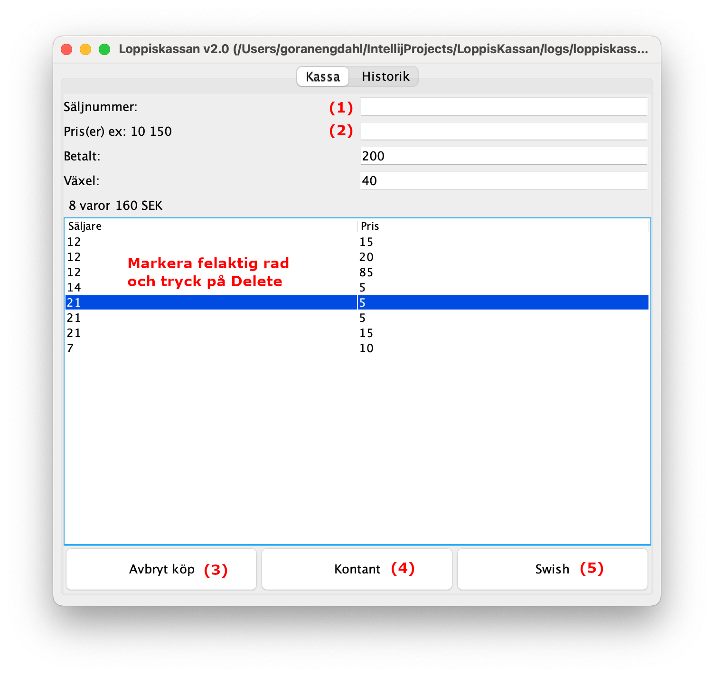
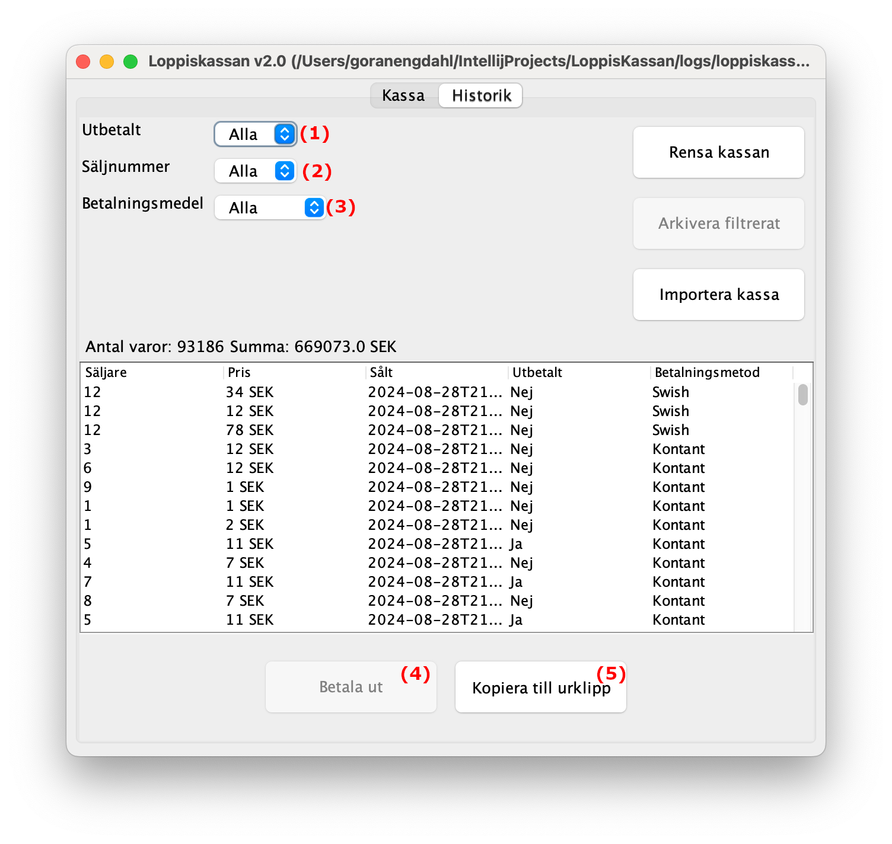
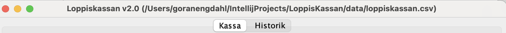

### Vad är Loppiskassan?
Loppiskassan är ett litet program som hjälper till med kassahantering och redovisning för inlämningsloppisar.

En inlämningsloppis är ett smart sätt att locka kunder till en stor loppis där flera säljare samsas om lokal och delar på kostnader.

Som säljare lämnar man in sina varor innan loppisen öppnar och hämtar pengar och eventuella osålda varor när loppisen är över.

### Användarmanual
Loppiskassan har två vyer: **Kassa** och **Historik**.

- **Kassavyn** används när man sitter i kassan och bokför köp.
- **Historikvyn** används för att räkna ut varje säljares förtjänst.

### Kassavyn


I kassavyn matar man in varje såld vara en kund köper. Varje sålt föremål har ett pris och ett säljnummer.

- Säljnumret skriver man in i första textfältet **(1)**, och priset i det andra **(2)** och avslutar med Retur/Enter. Detta upprepas för varje vara kunden köper.

> **Tips!**
> Om köparen har flera varor från samma säljare kan man skriva in flera priser med ett mellanslag emellan innan man trycker Retur/Enter.

Hela tiden räknas växeln ut som om man fått betalt i jämna hundralappar.

Avbryt köpet genom att trycka på **Avbryt köp** **(3)** och börja om med ett nytt köp.

> **Tips!**
> Vid felinmatning innan slutfört köp kan man markera en rad i kassavyn och trycka på Delete-tangenten för att ta bort den.

> **Tips!**
> Om du får en annan summa av kunden kan du slå in den i Betalt-textfältet för att räkna ut rätt växel.

När köpet är genomfört trycker man på **Kontant** **(4)** eller **Swish** **(5)** för att spara köpet i historiken och rensa alla fält så att nästa köp kan registreras.

### Historikvyn


I historikvyn kan man se alla sålda artiklar och göra filtrering på:

- **Utbetalt**
   - Alla
   - Ja
   - Nej
- **Säljnummer**
   - Alla
   - 1
   - 2
   - 3...
- **Betalningsmedel**
   - Alla
   - Swish
   - Kontant

När säljaren kommer för att hämta sin del av vinsten väljer man att filtrera på säljarens säljnummer **(1)**, Utbetalt: Alla **(2)**, Betalningsmedel: Alla **(3)**.

När utbetalningen är gjord bokförs denna genom att man klickar på **Betala ut** **(4)**. Önskar säljaren redovisning på sålda varor kan man klicka på **Spara i utklipp** **(5)** för att kopiera säljredovisningen till urklipp. Klistra sedan in (Ctrl + V) redovisningen i ett e-postprogram och skicka till säljaren.

Om fler köp redovisas efter att säljaren redan fått sin del av vinsten rekommenderas att man **Arkiverar** allt som redan är betalt för att enklare kunna se vad som är kvar att betala ut. Välj då Utbetalt: Ja, Säljnummer: Alla, Betalningsmedel: Alla och klicka på **Arkivera filtrerat** för att flytta filtrerade rader till en arkivfil (CSV).

Ett exempel på säljkvitto visas nedan.

```
Säljredovisning för säljare 5.
10471 sålda varor för totalt 75821 SEK.
Redovisningen omfattar följande betalningsmetoder: Alla
genomförda innan 2024-08-28T22:17:24.
Provision: 7582 Utbetalas säljare: 68239

1.	11 SEK Utbetalt
2.	11 SEK Utbetalt
3.	6 SEK Utbetalt
4.	7 SEK Utbetalt
5.	2 SEK Utbetalt
6.	16 SEK Utbetalt
7.	2 SEK Utbetalt
8.	3 SEK Utbetalt
...
 ```

Importera kassa
----------------
Om man har en stor loppis kan det vara bra att ha flera kassor öppna för att minska köbildning vid kassan.
Man kan efter loppisen välja ut en av kassorna som huvudkassa och importera alla köp från de andra kassorna till huvudkassan.
Varje kassa har en egen CSV-fil som innehåller alla köp som gjorts.
I titelbaren på programmet står sökvägen till den aktuella kassan (*loppiskassan.csv*).
> **Tips!**
> Om inte hela sökvägen syns kan du bredda fönstret för att se hela sökvägen.



Samla ihop alla dessa filer och importera dem en efter en i huvudkassan genom att klicka på **Importera kassa**.
Skulle du råka importera en kassa två gånger gör det inget, programmet upptäcker dubletter vid import och kastar bort dem.

> **Tips!**
> *Döp om filerna till loppisskassan_kassa1.csv, loppisskassan_kassa2.csv, loppisskassan_kassa3.csv... för att enklare hålla reda på vilken kassa som är vilken.*


