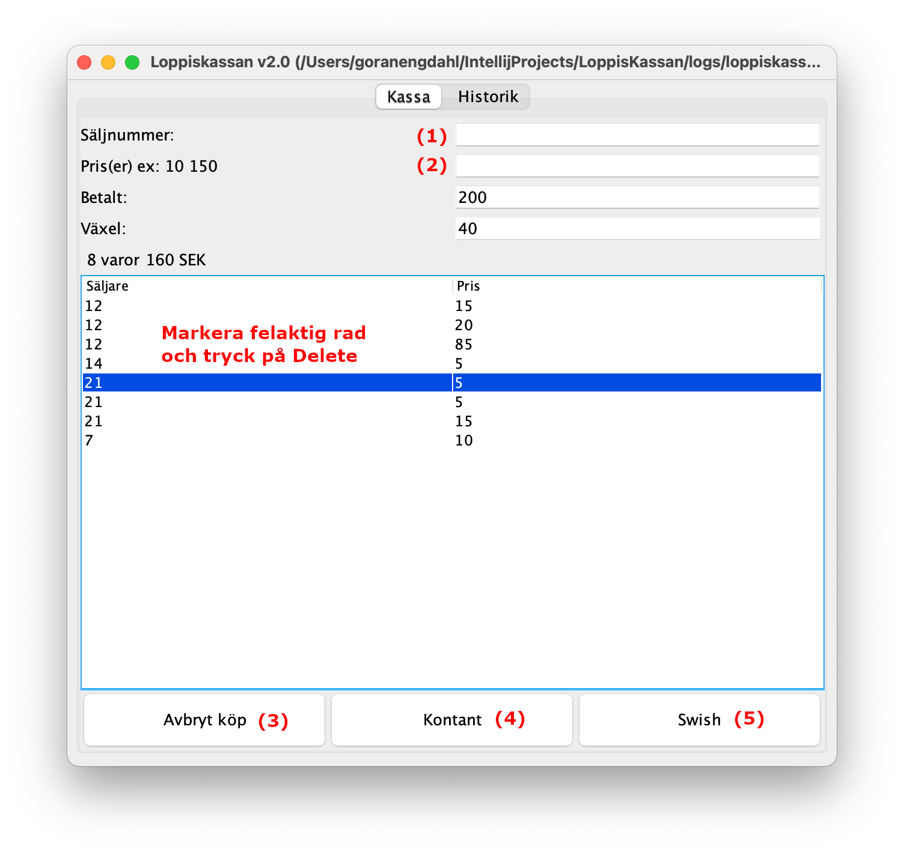
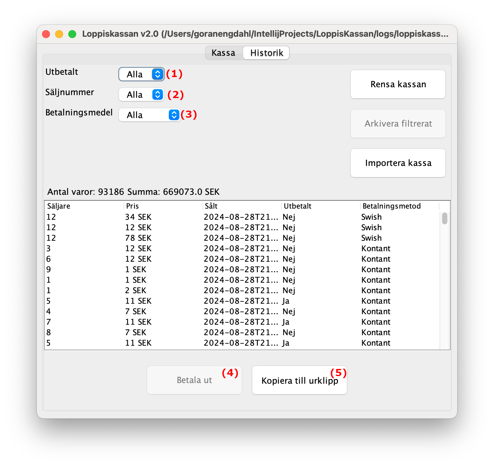

### Vad är Loppiskassan?
Loppiskassan är ett litet program som hjälper till med kassahantering och redovisning för inlämningsloppisar.

En inlämningsloppis är ett smart sätt att locka kunder till en stor loppis där flera säljare samsas om lokal och delar på kostnader.

Som säljare lämnar man in sina varor innan loppisen öppnar och hämtar pengar och eventuella osålda varor när loppisen är över.

### Användarmanual
Loppiskassan har två vyer: **Kassa** och **Historik**.

- **Kassavyn** används när man sitter i kassan och bokför köp.
- **Historikvyn** används för att räkna ut varje säljares förtjänst.

### Kassavyn


I kassavyn matar man in varje såld vara en kund köper. Varje sålt föremål har ett pris och ett säljnummer.

- Säljnumret skriver man in i första textfältet **(1)**, och priset i det andra **(2)** och avslutar med Retur/Enter. Detta upprepas för varje vara kunden köper.

> **Tips!**
> Om köparen har flera varor från samma säljare kan man skriva in flera priser med ett mellanslag emellan innan man trycker Retur/Enter.

Hela tiden räknas växeln ut som om man fått betalt i jämna hundralappar.

Avbryt köpet genom att trycka på **Avbryt köp** **(3)** och börja om med ett nytt köp.

> **Tips!**
> Vid felinmatning innan slutfört köp kan man markera en rad i kassavyn och trycka på Delete-tangenten för att ta bort den.

> **Tips!**
> Om du får en annan summa av kunden kan du slå in den i Betalt-textfältet för att räkna ut rätt växel.

När köpet är genomfört trycker man på **Kontant** **(4)** eller **Swish** **(5)** för att spara köpet i historiken och rensa alla fält så att nästa köp kan registreras.

### Historikvyn


I historikvyn kan man se alla sålda artiklar och göra filtrering på:

- **Utbetalt**
   - Alla
   - Ja
   - Nej
- **Säljnummer**
   - Alla
   - 1
   - 2
   - 3...
- **Betalningsmedel**
   - Alla
   - Swish
   - Kontant

När säljaren kommer för att hämta sin del av vinsten väljer man att filtrera på säljarens säljnummer **(1)**, Utbetalt: Alla **(2)**, Betalningsmedel: Alla **(3)**.

När utbetalningen är gjord bokförs denna genom att man klickar på **Betala ut** **(4)**. Önskar säljaren redovisning på sålda varor kan man klicka på **Spara i utklipp** **(5)** för att kopiera säljredovisningen till urklipp. Klistra sedan in (Ctrl + V) redovisningen i ett e-postprogram och skicka till säljaren.

Om fler köp redovisas efter att säljaren redan fått sin del av vinsten rekommenderas att man **Arkiverar** allt som redan är betalt för att enklare kunna se vad som är kvar att betala ut. Välj då Utbetalt: Ja, Säljnummer: Alla, Betalningsmedel: Alla och klicka på **Arkivera filtrerat** för att flytta filtrerade rader till en arkivfil (CSV).

Ett exempel på säljkvitto visas nedan.

```
Säljredovisning för säljare 5.
10471 sålda varor för totalt 75821 SEK.
Redovisningen omfattar följande betalningsmetoder: Alla
genomförda innan 2024-08-28T22:17:24.
Provision: 7582 Utbetalas säljare: 68239

1.	11 SEK Utbetalt
2.	11 SEK Utbetalt
3.	6 SEK Utbetalt
4.	7 SEK Utbetalt
5.	2 SEK Utbetalt
6.	16 SEK Utbetalt
7.	2 SEK Utbetalt
8.	3 SEK Utbetalt
...
 ```

Exportera och importera kassor (lokalt läge)
----------------
Om man har en stor loppis kan det vara bra att ha flera kassor öppna för att minska köbildning vid kassan.
Man kan efter loppisen välja ut en av kassorna som **huvudkassa** och importera alla köp från de andra kassorna.

### Exportera från slavkassa

1. Öppna det lokala evenemanget på kassadatorn.
2. Klicka på **📤 Exportera data** i eventpanelen.
3. Exportdialogen öppnas och visar:
   - Antal försäljningar som kommer exporteras
   - **Spara till:** — välj destination (standard: Skrivbordet)
   - **Filnamn:** — föreslaget namn baserat på eventnamn och datum, t.ex. `sillfest-kassa2-2026-02-09.jsonl`
4. Klicka på **Exportera**.
5. Överför den exporterade `.jsonl`-filen till huvudkassan via USB-minne, AirDrop eller liknande.

### Importera i huvudkassa

1. Öppna det lokala evenemanget i huvudkassan.
2. Gå till **Historik**-fliken.
3. Klicka på **Importera kassa**.
4. En filväljare öppnas — välj en eller flera `.jsonl`-filer från de andra kassorna.
5. Poster som redan finns i huvudkassan hoppas automatiskt över (dubbletthantering).
6. Klart — alla kassors försäljning finns nu samlad i huvudkassan.

> **Tips!**
> Du kan välja flera filer samtidigt i filväljaren.

> **Tips!**
> Skulle du råka importera samma kassa två gånger gör det inget — programmet upptäcker dubletter och kastar bort dem automatiskt.

> **Tips!**
> *Ge varje kassa ett tydligt namn vid export, t.ex. sillfest-kassa1.jsonl, sillfest-kassa2.jsonl — så vet du vilken fil som hör till vilken kassa.*


---

Online- och lokalt läge
================

Loppiskassan har stöd för två arbetslägen:

| | Online-läge (iLoppis) | Lokalt läge |
|---|---|---|
| **Internet krävs** | Ja | Nej |
| **Kassakod** | Krävs (XXX-XXX) | Krävs ej |
| **Data sparas** | På iLoppis-servern | Lokalt på datorn |
| **Flera kassor** | Synkas automatiskt i realtid | Manuell export/import |
| **Rekommenderas** | ✅ Alltid i första hand | ⚠️ Undantagsfall |

### Rekommendation: Använd alltid online-läge
Online-läget med iLoppis är det rekommenderade sättet att köra en loppis. Det ger:
- Automatisk synkronisering mellan alla kassor
- Realtidsöversikt via iLoppis webbsida
- Ingen risk att tappa data vid datorkrasch
- Enkel hantering av säljare, utbetalningar och redovisning

**Lokalt läge ska bara användas i undantagsfall**, exempelvis:
- Loppisen hålls i en lokal helt utan internetåtkomst
- Tillfälligt nätverksavbrott under pågående loppis
- Testning och övning innan en riktig loppis

---

Arbeta lokalt utan internet
================

### 1. Skapa ett lokalt evenemang

1. Gå till fliken **Välj Loppis**.
2. Klicka på **Skapa lokalt evenemang**.
3. Fyll i uppgifterna:
   - **Namn** (obligatoriskt) — t.ex. "Sillfest kassa 1"
   - **Beskrivning** — valfri beskrivning
   - **Gatuadress** och **Stad** — var loppisen hålls
   - **Fördelning** — ställ in hur intäkterna fördelas mellan arrangör, säljare och iLoppis (måste summera till 100%)
4. Klicka på **Skapa evenemang**.
5. Det nya evenemanget väljs automatiskt i listan.
6. Klicka på **Öppna kassa** — ingen kassakod behövs för lokala evenemang.

### 2. Registrera försäljning

Kassavyn fungerar likadant oavsett om man kör online eller lokalt. Se avsnittet *Kassavyn* ovan.

### 3. Hantera flera kassor

Om du behöver flera kassor (t.ex. vid en stor loppis):

1. **Förbered före loppisen:**
   - Installera Loppiskassan på varje kassadator.
   - Skapa ett lokalt evenemang på varje dator.
   - Ge varje kassa ett tydligt namn, t.ex. "Sillfest kassa 1", "Sillfest kassa 2".

2. **Under loppisen:**
   - Varje kassa registrerar sina köp oberoende av de andra.
   - Ingen internetanslutning behövs.

3. **Efter loppisen — samla ihop kassorna:**

   **På varje slavkassa:**
   - Klicka på **📤 Exportera data** (syns i eventpanelen för lokala evenemang med försäljningar).
   - Välj en mapp och filnamn (föreslaget: `{eventnamn}-{datum}.jsonl`).
   - Överför filen till huvudkassan via USB-minne, AirDrop eller liknande.

   **På huvudkassan:**
   - Gå till **Historik**-fliken.
   - Klicka på **Importera kassa**.
   - Välj de exporterade `.jsonl`-filerna.
   - Dubbletter hoppas automatiskt över — det gör inget om du importerar samma kassa flera gånger.

4. **Gör utbetalningar:**
   - All data finns nu samlad i huvudkassan.
   - Filtrera på säljnummer i Historik-vyn och gör utbetalningar som vanligt.

> **Tips!**
> En 📤-ikon visas också i evenemangslistan bredvid lokala evenemang som har försäljningsdata. Du kan klicka direkt på den för snabb export.

---

Ladda upp lokal data till iLoppis
================

Om du råkat köra en loppis i lokalt läge men vill att datan ska synkroniseras till iLoppis i efterhand, kan du ladda upp den.

### Förutsättningar
- Du har ett lokalt evenemang med försäljningsdata.
- Det finns ett motsvarande evenemang skapat i iLoppis (online).
- Du har en giltig kassakod (XXX-XXX) för online-evenemanget.
- Du har internetanslutning.

### Steg-för-steg

1. Öppna det lokala evenemanget i Loppiskassan.
2. Klicka på **☁️ Ladda upp** i eventpanelen.
3. Dialogen **"Ladda upp till iLoppis"** öppnas med:
   - **Sökfält** — skriv för att filtrera bland backend-evenemang (söker på namn och stad).
   - **Backend-event** — välj det iLoppis-evenemang som datan ska laddas upp till.
   - **Kassakod (XXX-XXX)** — ange kassakoden för online-evenemanget.
   - **Förhandsgranskning** — visar antal artiklar, köp och total summa som kommer laddas upp.
4. Klicka på **Ladda upp**.
5. Uppladdningen körs i bakgrunden med en progressindikator.
6. En sammanfattning visas:
   - ✅ **Accepterade** — artiklar som laddades upp framgångsrikt.
   - ⚠️ **Dubbletter** — artiklar som redan fanns på servern (säkert att ignorera).
   - ❌ **Misslyckade** — artiklar som inte kunde laddas upp.

### Idempotent uppladdning
Du kan tryggt köra uppladdningen flera gånger. Artiklar som redan laddats upp markeras lokalt och skickas inte igen. Dubbletter avvisas av servern med felkoden `DUPLICATE_RECEIPT`, vilket inte räknas som ett fel.

### Vid problem
- **"Kassakoden är felaktig"** — kontrollera att du angett rätt kassakod för rätt evenemang.
- **"Du har inte behörighet"** — kassakoden har inte rättigheter till det valda evenemanget.
- **"Nätverksfel"** — kontrollera internetanslutningen och försök igen.


